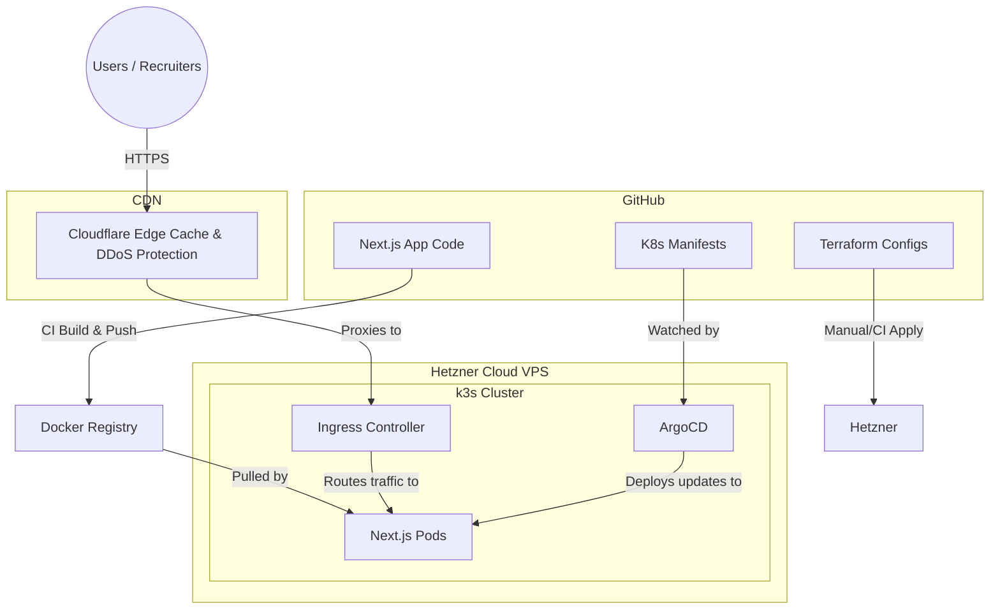

# Architecture Overview

This document outlines the architectural design and deployment strategy for the AlecLabs Portfolio, migrating from a Serverless Google Cloud Run foundation to a robust, bare-metal Kubernetes infrastructure.

## 1. Requirements & Goals
- **Cost Efficiency**: Minimize ongoing hosting costs while maximizing compute capacity.
- **SRE & Platform Engineering Demonstration**: The infrastructure must serve as a live demonstration of advanced Site Reliability Engineering skills, specifically GitOps, Kubernetes orchestration, and declarative Infrastructure as Code.
- **Geographic Flexibility**: Ability to tear down and rapidly spin up the cluster in different geographic regions to minimize latency for specific target audiences (e.g., West Coast vs. East Coast recruiters).
- **Multi-Tenant Extensibility**: Serve as a foundational playground for future backend APIs and homelab services without incurring per-service PaaS costs.
- **Core Web Vitals & SEO**: Ensure fast SSR performance (Next.js) and edge-cached static assets (via CDN) to maintain a 100/100 Lighthouse score.

## 2. The Tech Stack Migration
Historically, this project utilized **Google Cloud Run** and **Firebase Hosting**. 

### Justification for Switching the Stack
While Cloud Run provides an excellent developer experience (Pay-per-Execution, managed scaling), it is suboptimal for this project's specific goals for two primary reasons:
1. **Compute per Dollar**: Serverless abstracts away infrastructure but charges a massive premium. For "always-on" workloads (like an ArgoCD control plane or metrics stack), the costs on GCR skyrocket. Moving to **Hetzner Cloud VPS** provides a massive increase in compute-per-dollar (e.g., 2 vCPUs / 4GB RAM for ~$5/month).
2. **Portfolio Value (SRE Focus)**: Managed serverless abstracts away the very K8s and Linux networking skills this portfolio is designed to showcase. Deploying a lightweight Kubernetes distribution (`k3s`) onto bare-metal/VPS instances and managing it via **ArgoCD** proves a much deeper understanding of distributed systems and Platform Engineering.

## 3. Deployment Architecture

The new architecture relies on three primary pillars:
1. **Terraform**: Provisions the underlying Hetzner Cloud infrastructure (VPS instances, floating IPs, firewalls).
2. **Kubernetes (k3s)**: A lightweight K8s distribution running on the Hetzner node, exposing services via an Ingress Controller (Traefik/NGINX).
3. **ArgoCD (GitOps)**: Monitors the GitHub repository and automatically synchronizes the cluster state with the manifests defined in code, enabling Blue/Green deployments.

### Docker Containerization Strategy
To ensure the Next.js application remains lightweight and secure within the cluster, the project utilizes an optimized multi-stage `Dockerfile` at the repository root. This approach replaces legacy layered image strategies (e.g., separate base/middleware images).
- **Multi-Stage Build**: Separates dependency installation, building, and the final runtime environment.
- **Standalone Output**: Leverages Next.js `output: 'standalone'` to trim node_modules, resulting in a minimal production image containing only necessary files.
- **Security**: The final image runs under a non-root `nextjs` user and group to comply with Kubernetes security best practices.

### Pipeline Diagram

## 4. Problem Solutions
- **Cold Starts**: Cloud Run scales to zero, resulting in a 2-5 second delay for the first visitor. The Hetzner cluster is always-on, ensuring instant Time to First Byte (TTFB).
- **Cost Spikes**: A flat monthly rate on Hetzner prevents the unpredictable billing spikes associated with serverless background tasks or accidental infinite loops.
- **SEO Limitations**: By placing Cloudflare in front of the Hetzner VPS, we mask the underlying IP address and cache static content globally, securing the benefits of edge computing without the PaaS price tag.
